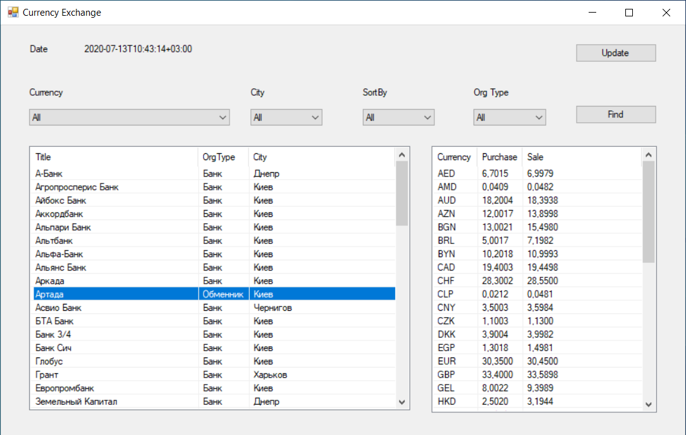
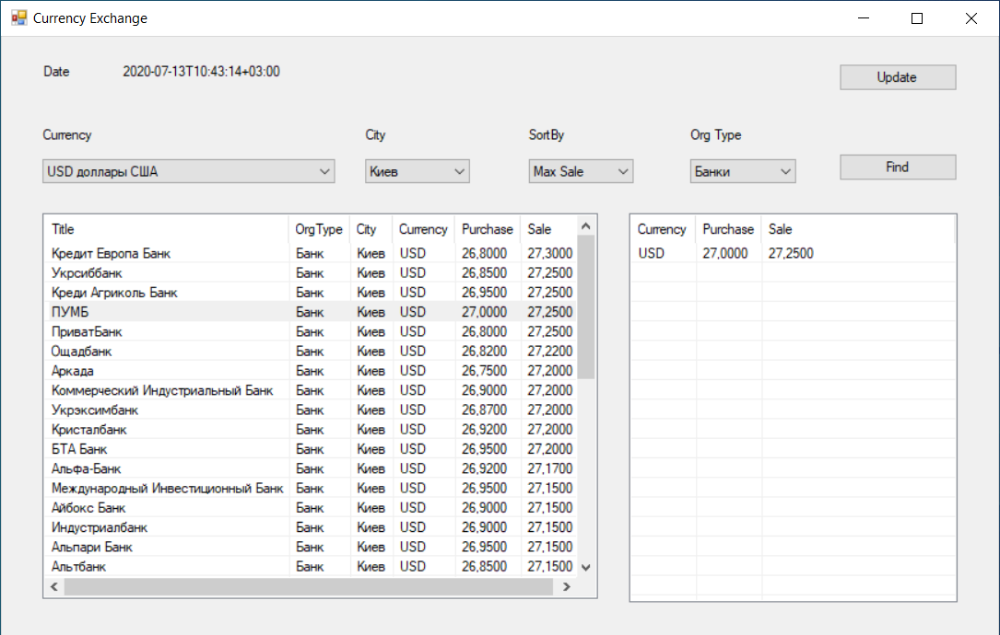

# NBUExchangeRatesClient
Get exchange rates from National Bank of Ukraine.

## Description
Programm parses XML file with currencies information from site of National Bank of Ukraine and stores it in PostgreSQL database.
Then you can see which currencies has organisation or find specific one using filters like currency, city, organisation type (bank or exchanger) and sort by max sale or min purchase.

## Screenshots

### Main screen

### Using filters

